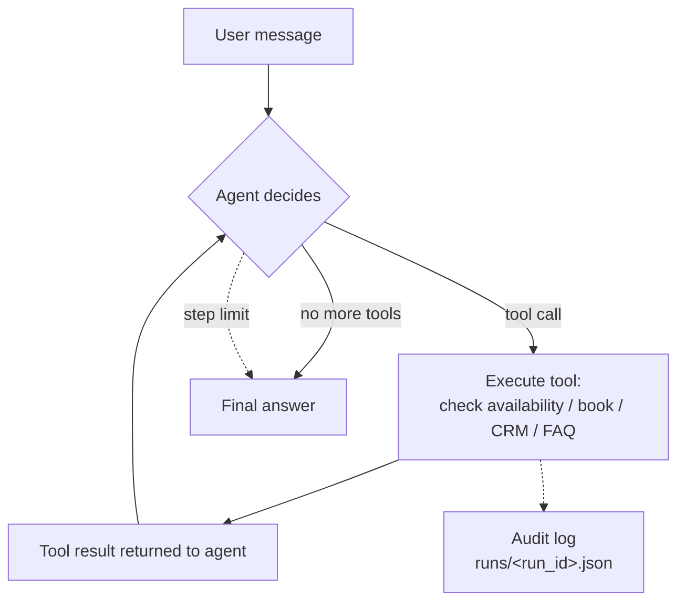

# AI Automation Agent — Tool-Use Agent (Function Calling)

An AI agent that **takes actions, not just answers** — it calls business tools (check availability, book sessions, upsert CRM contacts, answer FAQs) the way an automation team expects: decision → tool call → verified result → next step. Built on my real practice workflow and fully runnable **offline with no API key**.

This is the #2 AI-Automation interview topic: **"agents / tool use / function calling."** Here it is implemented, tested, and demo-ready.

[](https://github.com/mzpakistani9-commits/ai-automation-agent/actions)

---

## What it does

| Capability | Detail |
|---|---|
| **Tool use / function calling** | Agent decides which tool to call, executes it, and feeds the result back into the loop |
| **Business tools** | `check_availability`, `book_session`, `list_bookings`, `upsert_contact`, `lookup_faq` |
| **Two run modes** | Real LLM (OpenAI function calling) **or** deterministic offline fallback — no key needed for CI/demo |
| **Audit trail** | Every run saved as a JSON transcript (`role/tool/output`) — the "monitoring" an ops team wants |
| **CRM integration** | Booking auto-creates/updates a client record (`stage = booked`) |
| **API + webhooks-ready** | FastAPI: `/agent` (POST), `/tools` (schema), `/runs/{id}` (audit) |

## Agent loop



The loop runs up to `MAX_STEPS` (default 6): each round the model emits a `tool_calls` request, the runner executes it against the real tool handler, appends the result to the message thread, and repeats until the model answers without tools.

## Quick start

```bash
pip install -r requirements.txt
python scripts/demo.py            # offline demo: FAQ → availability → booking → bookings
uvicorn app.main:app --port 8000  # start API
```

```bash
# Ask the agent to book a session (no API key needed)
curl -X POST http://localhost:8000/agent \
  -H "Content-Type: application/json" \
  -d '{"message": "I want to book a session for Sara on 2026-09-16 at 09:00"}'

# Inspect which tools the agent can call
curl http://localhost:8000/tools

# Read the audit trail of a run
curl http://localhost:8000/runs/<run_id>
```

### Switch to a real LLM

```bash
export OPENAI_API_KEY=sk-...
export OPENAI_MODEL=gpt-4o-mini
```

No key? `AGENT_PROVIDER=local` uses a keyword-routed fallback that drives the same tools — so the demo and tests run in CI with zero secrets.

## Business tools

| Tool | JSON schema (abridged) | What it does |
|---|---|---|
| `check_availability` | `{date}` | Lists free slots for a date, or next available days |
| `book_session` | `{date, time, contact}` | Reserves a slot; blocks double-booking |
| `list_bookings` | `{}` | All upcoming booked sessions |
| `upsert_contact` | `{name, email, phone, company, stage, notes}` | Creates/updates a client in the CRM |
| `lookup_faq` | `{query}` | Answers practice questions (cost, cancellation, etc.) |
| `send_confirmation` | `{to, date, time}` | Queues a session-confirmation email to the outbox |

Tools are declared as **JSON schemas** (`tools/registry.py` → `Toolbox.schemas()`), the same shape OpenAI function-calling consumes, so adding a tool = adding a schema + a handler.

## Where this came from

This is automated from a real business need: a clinical psychology intake booking flow. The agent:

1. Reads whether the user wants to book, check availability, or ask a question
2. Checks the calendar for a free slot
3. Books the session (no double-booking)
4. Upserts the client into a CRM at `stage = booked`
5. Queues a confirmation email to the client
6. Logs the full transcript for audit/reporting

That seniority gap — understanding a business process and converting it into a reliable automated workflow — is exactly what the JD asks for.

## Eval / reliability story

- **10 unit tests** cover tool schemas, unknown-tool handling, real booking state changes, CRM create-then-update, confirmation-email queueing, and end-to-end offline bookings (green in CI).
- **Audit trail** = every tool invocation is recorded; nothing happens silently.
- **Deterministic offline mode** lets tests assert exact behavior without flaky LLM calls.
- **Double-booking is impossible** by design — `book_session` only removes a slot that is actually open.

## Repo layout

```text
app/
├── config.py          # env-driven settings
├── stores.py          # CalendarStore + CRMStore + OutboxStore (JSON persistence)
├── runner.py          # agent loop: LLM function calling + offline fallback
└── main.py            # FastAPI: /agent /tools /runs, /health
tools/
├── registry.py        # Tool dataclass + Toolbox (JSON schemas + dispatch)
└── business_tools.py  # the 6 business tools
scripts/demo.py        # offline end-to-end demo
tests/test_agent.py    # 10 tests, CI-gated
```

## Configuration

| Env var | Default | Purpose |
|---|---|---|
| `AGENT_PROVIDER` | `local` | `local` (offline) or `openai` |
| `OPENAI_API_KEY` / `OPENAI_MODEL` | — / `gpt-4o-mini` | Real LLM function calling |
| `MAX_STEPS` | `6` | Max tool rounds per run |
| `RUNS_DIR` | `./runs` | Audit logs |
| `CRM_PATH` / `CALENDAR_PATH` | `./data/*.json` | Business data persistence |

---

Part of the AI-automation portfolio: [rag-support-agent](https://github.com/mzpakistani9-commits/rag-support-agent) (RAG retrieval) · [n8n-automation-workflows](https://github.com/mzpakistani9-commits/n8n-automation-workflows) (platform workflows) · this agent (tool use).